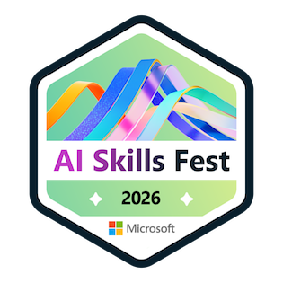
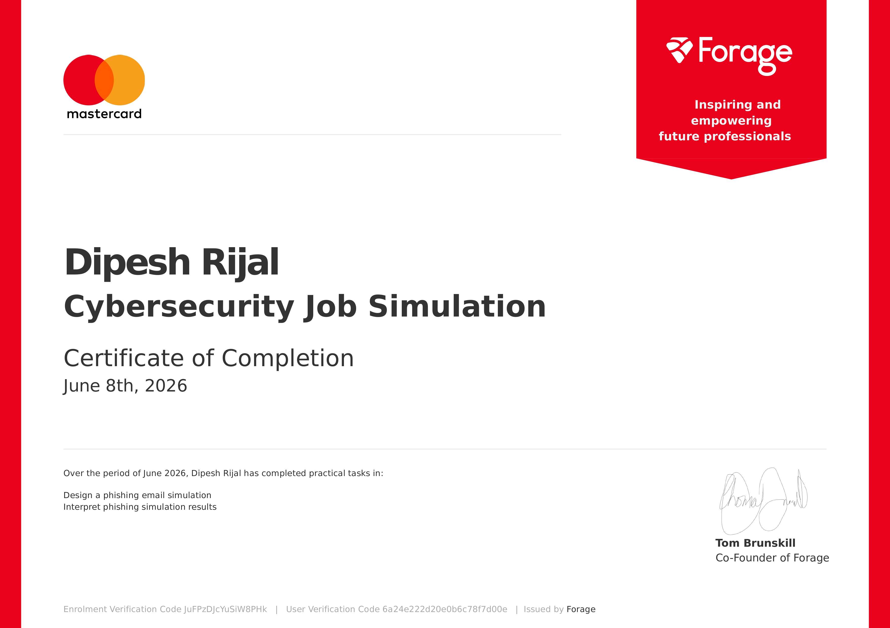

# Hi, I'm Dipesh Rijal
### BIT Student | Networking & Cloud Computing Learner | Cybersecurity Enthusiast | CCNA Aspirant

I'm a Bachelor of Information Technology (BIT) student from Itahari, Nepal, with a strong interest in networking, cloud computing, and cybersecurity.  I'm currently building my foundation through the CCNA learning path while exploring network infrastructure, cloud platforms, Linux systems, and information security. My long-term goal is to work in Network Engineering, Cloud Operations, and Cybersecurity.  Alongside that, I build modern web applications using React and TypeScript. These projects help me strengthen my problem-solving skills and understand how software and infrastructure work together. I believe in learning by doing, contributing to open communities, and improving through practical experience, certifications, and real-world projects.

---

## Socials

---

## Tech Stack

**Networking & Cloud**

    

**Languages**

      

**Frontend**

  

**Backend & Databases**

    

**Data & Tools**

      

---

## Current Focus

- Studying computer networking and preparing for CCNA
- Exploring cloud computing fundamentals (AWS & GCP)
- Learning cybersecurity concepts and network security principles
- Improving Linux and system administration skills
- Learning Python for automation and infrastructure tasks
- Open to collaboration and community learning

---

## Featured Project

**BaghChal: Nepal's Traditional Strategy Game**

A modern implementation of Nepal's traditional strategy game. The project combines cultural heritage with modern web technologies while helping me strengthen my frontend development and problem-solving skills.

Repo (Source Code): [github.com/DipeshR23/baghchal_game](https://github.com/DipeshR23/baghchal_game)

live Demo: https://baghchalgame.vercel.app

**Built with:** React • TypeScript • Vite • Tailwind CSS • Vercel

---

## Certifications & Digital Badges

- Microsoft AI Skills Fest 2026

  

  <a href="https://www.credly.com/badges/53718e8e-f303-41d9-8ea8-0216bff390c2/public_url">
    🔗 Verify Credential
  </a>

- Deloitte Australia Cyber Job Simulation (Forage)

  

  <a href="https://www.theforage.com/completion-certificates/9PBTqmSxAf6zZTseP/E9pA6qsdbeyEkp3ti_9PBTqmSxAf6zZTseP_6a24e222d20e0b6c78f7d00e_1780809489947_completion_certificate.pdf">
    🔗 Verify Credential
  </a>

- Mastercard Cybersecurity Job Simulation (Forage)

  

  <a href="https://www.theforage.com/completion-certificates/mfxGwGDp6WkQmtmTf/vcKAB5yYAgvemepGQ_mfxGwGDp6WkQmtmTf_6a24e222d20e0b6c78f7d00e_1780888851345_completion_certificate.pdf">
    🔗 Verify Credential
  </a>

---

##  GitHub Activity

  

  

---

## Future Projects

- Cisco Packet Tracer Lab Repository
- CCNA Study Notes and Resources
- Python Network Automation Scripts
- Linux Administration Notes
- AWS & Google Cloud Learning Projects
- Cybersecurity Practice Labs

---

I'm always happy to connect with students, developers, networking enthusiasts, and cybersecurity learners. Whether it's discussing technology, collaborating on projects, or sharing learning resources, feel free to reach out.
